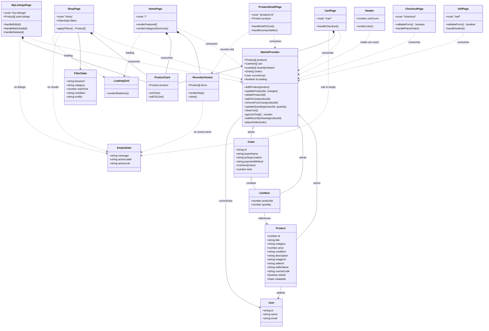

# Campus Marketplace Class Diagram

```mermaid
classDiagram
    direction TB

    class Product {
        +number id
        +string title
        +string category
        +number price
        +string condition
        +string description
        +string imageUrl
        +string sellerId
        +string sellerName
        +string courseCode
        +boolean isSold
        +Date createdAt
    }

    class CartItem {
        +number productId
        +number quantity
    }

    class User {
        +string id
        +string name
        +string email
    }

    class Order {
        +string id
        +string buyerName
        +string pickupLocation
        +string paymentMethod
        +CartItem[] items
        +number total
    }

    class FilterState {
        +string keyword
        +string category
        +number maxPrice
        +string condition
        +string sortBy
    }

    class MarketProvider {
        +Product[] products
        +CartItem[] cart
        +number[] recentlyViewed
        +Order[] orders
        +User currentUser
        +boolean isLoading
        +addProduct(product)
        +updateProduct(id, changes)
        +deleteProduct(id)
        +addToCart(productId)
        +removeFromCart(productId)
        +updateQuantity(productId, quantity)
        +clearCart()
        +getCartTotal() number
        +addRecentlyViewed(productId)
        +placeOrder(order)
    }

    class HomePage {
        +route "/"
        +renderFeatured()
        +renderCategoryShortcuts()
    }

    class ShopPage {
        +route "/shop"
        +FilterState filters
        +applyFilters() Product[]
    }

    class ProductDetailPage {
        +route "/product/:id"
        +Product product
        +handleAddToCart()
        +handleContactSeller()
    }

    class SellPage {
        +route "/sell"
        +validateForm() boolean
        +handleSubmit()
    }

    class CartPage {
        +route "/cart"
        +handleCheckout()
    }

    class CheckoutPage {
        +route "/checkout"
        +validateForm() boolean
        +handlePlaceOrder()
    }

    class MyListingsPage {
        +route "/my-listings"
        +Product[] userListings
        +handleEdit(id)
        +handleMarkSold(id)
        +handleDelete(id)
    }

    class Header {
        +number cartCount
        +renderLinks()
    }

    class ProductCard {
        +Product product
        +onClick()
        +addToCart()
    }

    class RecentlyViewed {
        +Product[] items
        +renderStrip()
        +clear()
    }

    class EmptyState {
        +string message
        +string actionLabel
        +string actionLink
    }

    class LoadingGrid {
        +renderSkeletons()
    }

    MarketProvider o-- Product : stores
    MarketProvider o-- CartItem : stores
    MarketProvider o-- Order : stores
    MarketProvider --> User : currentUser
    CartItem --> Product : references
    Order o-- CartItem : contains
    Product --> User : sellerId

    HomePage ..> MarketProvider : consumes
    ShopPage ..> MarketProvider : consumes
    ProductDetailPage ..> MarketProvider : consumes
    SellPage ..> MarketProvider : consumes
    CartPage ..> MarketProvider : consumes
    CheckoutPage ..> MarketProvider : consumes
    MyListingsPage ..> MarketProvider : consumes
    Header ..> MarketProvider : reads cart count

    HomePage *-- RecentlyViewed
    HomePage *-- ProductCard
    ShopPage *-- ProductCard
    ShopPage --> FilterState
    CartPage *-- ProductCard
    MyListingsPage *-- ProductCard
    ProductDetailPage ..> RecentlyViewed : records visit

    ShopPage ..> EmptyState : no results
    ShopPage ..> LoadingGrid : loading
    CartPage ..> EmptyState : cart is empty
    MyListingsPage ..> EmptyState : no listings
    HomePage ..> LoadingGrid : loading
    RecentlyViewed ..> EmptyState : no recent items
```
